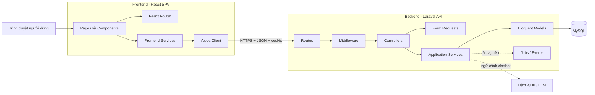
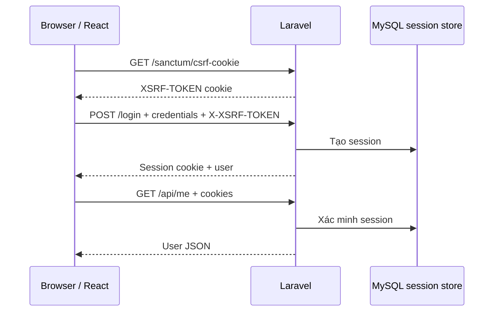
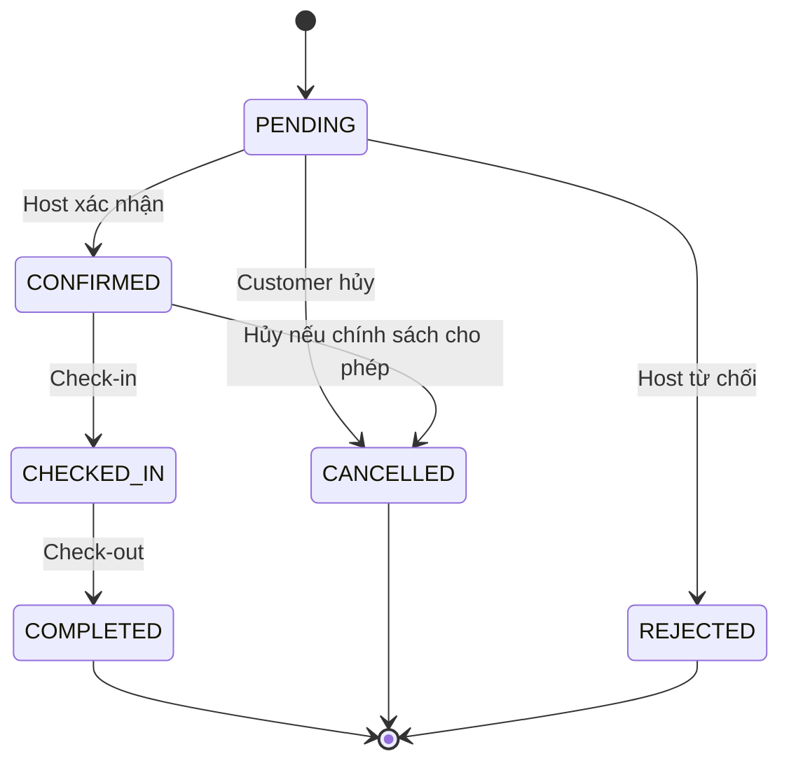
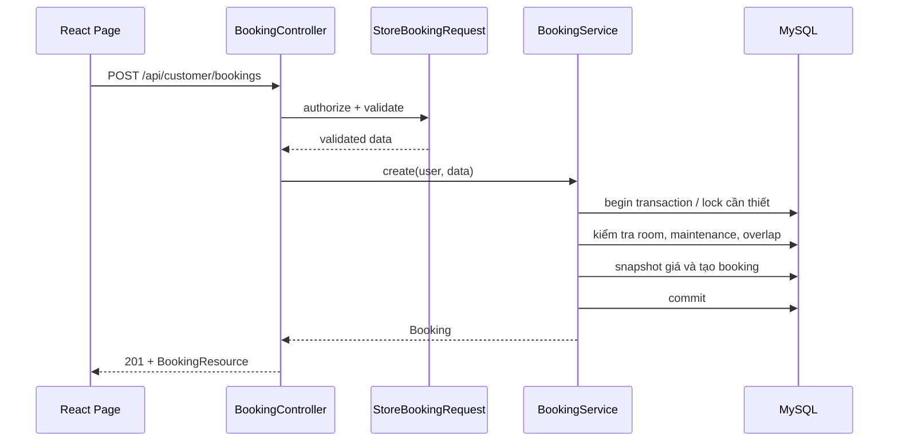

# Kiến trúc hệ thống StayHub

Tài liệu này mô tả kiến trúc kỹ thuật của StayHub, ranh giới giữa frontend và backend, cấu trúc thư mục của từng ứng dụng, luồng dữ liệu, quy tắc nghiệp vụ và định hướng mở rộng khi triển khai các module tiếp theo.

> **Trạng thái tài liệu:** repository hiện mới ở giai đoạn khởi tạo. Những phần được ghi là **hiện có** phản ánh đúng mã nguồn tại thời điểm cập nhật; những phần ghi là **kiến trúc mục tiêu** là cấu trúc cần bổ sung dần, không có nghĩa là đã được triển khai.

## 1. Tổng quan hệ thống

StayHub được tổ chức theo mô hình monorepo gồm hai ứng dụng độc lập:

- `frontend/`: Single Page Application (SPA) viết bằng React và Vite;
- `backend/`: REST API viết bằng Laravel, đồng thời quản lý xác thực session bằng Sanctum;
- MySQL: nơi lưu dữ liệu nghiệp vụ và session;
- dịch vụ AI/LLM: thành phần tùy chọn cho chatbot, chỉ được gọi thông qua backend.

Ở mức triển khai, đây là kiến trúc **client-server tách biệt**. Ở mức mã nguồn backend, hệ thống đi theo hướng **modular monolith có phân lớp**: các module nghiệp vụ cùng chạy trong một ứng dụng Laravel nhưng được tách theo trách nhiệm.



### Ranh giới trách nhiệm

| Thành phần | Chịu trách nhiệm | Không chịu trách nhiệm |
| --- | --- | --- |
| Frontend | hiển thị UI, điều hướng, thu thập input, trạng thái giao diện, gọi API | quyết định quyền truy cập, tính giá cuối cùng, xác nhận phòng trống |
| Backend | xác thực, phân quyền, validation, nghiệp vụ, transaction, chuẩn hóa response | phụ thuộc vào việc frontend đã ẩn/hiện nút đúng hay chưa |
| Database | lưu dữ liệu, khóa ngoại, unique/index, tính toàn vẹn cơ bản | thay thế validation và authorization ở backend |
| AI/LLM | sinh câu trả lời từ ngữ cảnh backend cung cấp | truy cập trực tiếp database hoặc tự ý tạo/hủy booking |

## 2. Cấu trúc repository

```text
stayhub/
├── backend/                         # Ứng dụng Laravel 12
├── frontend/                        # Ứng dụng React 19 + Vite
├── docs/
│   ├── stayhub-erd.md               # ERD và data dictionary mục tiêu
│   ├── stayhub-screen-mockups.md    # Danh sách màn hình
│   └── stayhub-usecase-system.md    # Actor, use case và luồng nghiệp vụ
├── ARCHITECTURE.md                  # Tài liệu kiến trúc này
└── README.md                        # Giới thiệu và cách chạy dự án
```

Hai thư mục `frontend/` và `backend/` có dependency, lệnh build và tiến trình chạy riêng. Không import mã nguồn trực tiếp qua lại giữa hai ứng dụng; hợp đồng tích hợp là HTTP/JSON.

## 3. Kiến trúc frontend

### 3.1 Công nghệ và kiểu kiến trúc

- React 19 xây dựng giao diện theo component;
- Vite 8 cung cấp dev server và đóng gói production;
- React Router DOM 7 điều hướng phía client;
- Axios làm HTTP client;
- JavaScript/JSX;
- ESLint kiểm tra chất lượng mã nguồn.

Frontend đi theo kiến trúc **component-based kết hợp route/layout và service layer**:

```text
main.jsx
  -> BrowserRouter
    -> App.jsx
      -> AppRouter.jsx
        -> Layout theo nhóm người dùng
          -> Page
            -> Feature/Common Component
              -> Service
                -> Axios Client
                  -> Laravel API
```

### 3.2 Cấu trúc frontend hiện có

```text
frontend/
├── public/                          # Static assets phục vụ nguyên trạng (khi có)
├── src/
│   ├── api/
│   │   └── axios.js                 # Axios instance dùng chung
│   ├── assets/                      # Ảnh, font, icon được bundler xử lý
│   ├── components/
│   │   ├── admin/                   # Component riêng cho Admin
│   │   ├── common/                  # Component tái sử dụng toàn hệ thống
│   │   ├── customer/                # Component riêng cho Customer
│   │   └── host/                    # Component riêng cho Host
│   ├── hooks/                       # Custom React hooks
│   ├── layouts/
│   │   ├── AdminLayout.jsx
│   │   ├── CustomerLayout.jsx
│   │   ├── HostLayout.jsx
│   │   └── PublicLayout.jsx
│   ├── pages/
│   │   ├── admin/
│   │   │   └── AdminDashboardPage.jsx
│   │   ├── customer/
│   │   │   └── CustomerDashboardPage.jsx
│   │   ├── host/
│   │   │   └── HostDashboardPage.jsx
│   │   └── public/
│   │       ├── ApiTestPage.jsx
│   │       ├── HomePage.jsx
│   │       └── LoginTestPage.jsx
│   ├── routes/
│   │   └── AppRouter.jsx            # Khai báo route và layout
│   ├── services/                    # Đang trống, dành cho API theo module
│   ├── utils/                       # Đang trống, helper thuần
│   ├── App.jsx                      # Root component
│   ├── index.css                    # CSS toàn cục
│   └── main.jsx                     # Entry point, mount React
├── .env                             # Biến môi trường local, không commit
├── eslint.config.js
├── index.html
├── package.json
└── vite.config.js
```

Các route hiện có:

| URL | Layout | Page | Trạng thái bảo vệ |
| --- | --- | --- | --- |
| `/` | `PublicLayout` | `HomePage` | public |
| `/api-test` | `PublicLayout` | `ApiTestPage` | public, dùng kiểm tra kết nối |
| `/login-test` | `PublicLayout` | `LoginTestPage` | public, dùng kiểm tra Sanctum |
| `/customer` | `CustomerLayout` | `CustomerDashboardPage` | chưa có route guard frontend |
| `/host` | `HostLayout` | `HostDashboardPage` | chưa có route guard frontend |
| `/admin` | `AdminLayout` | `AdminDashboardPage` | chưa có route guard frontend |

### 3.3 Trách nhiệm từng lớp frontend

#### `pages/`

Page đại diện cho một màn hình gắn với URL. Page được phép điều phối dữ liệu và trạng thái của màn hình, nhưng không nên chứa chi tiết cấu hình Axios hoặc lặp lại logic gọi API.

#### `layouts/`

Layout định nghĩa khung giao diện dùng chung cho từng vùng public, customer, host và admin. `Outlet` là vị trí render page con. Layout có thể chứa navbar, sidebar và footer, nhưng kiểm tra quyền thật sự vẫn phải diễn ra tại backend.

#### `components/`

- `common/`: button, modal, table, pagination, loading, error state;
- `customer/`, `host/`, `admin/`: component chỉ dùng trong phạm vi vai trò tương ứng.

Component nên nhận dữ liệu qua props và phát sự kiện; không nên tự biết quá nhiều về URL API nếu logic đó có thể đặt trong service.

#### `services/`

Đây là lớp giao tiếp với backend theo module. Kiến trúc mục tiêu:

```text
services/
├── authService.js
├── propertyService.js
├── roomService.js
├── bookingService.js
├── invoiceService.js
├── reviewService.js
└── chatbotService.js
```

Page gọi hàm nghiệp vụ như `bookingService.create(payload)` thay vì gọi `axios.post(...)` rải rác. Service chịu trách nhiệm endpoint và tham số; page chịu trách nhiệm trạng thái loading/success/error.

#### `api/axios.js`

Axios instance hiện đọc `VITE_BACKEND_URL`, gửi header `Accept: application/json`, cookie (`withCredentials`) và XSRF token (`withXSRFToken`). Vì `/login` và `/sanctum/csrf-cookie` nằm ngoài `/api`, base URL nên là origin backend, ví dụ `http://localhost:8000`; các API nghiệp vụ phải gọi với tiền tố `/api/...`.

#### `hooks/` và `utils/`

- hook chứa logic React có thể tái sử dụng, ví dụ `useAuth`, `usePagination`;
- utility là hàm thuần, ví dụ format tiền/ngày hoặc ánh xạ trạng thái;
- không đặt business rule quan trọng chỉ ở hai thư mục này vì backend mới là source of truth.

### 3.4 Cấu trúc frontend mục tiêu khi mở rộng

```text
src/
├── api/
│   └── axios.js
├── assets/
├── components/{common,customer,host,admin}/
├── contexts/
│   └── AuthContext.jsx
├── hooks/
├── layouts/
├── pages/{public,customer,host,admin}/
├── routes/
│   ├── AppRouter.jsx
│   ├── ProtectedRoute.jsx
│   └── RoleRoute.jsx
├── services/
├── utils/
├── App.jsx
├── index.css
└── main.jsx
```

`ProtectedRoute` chỉ cải thiện trải nghiệm điều hướng. Nó không thay thế `auth:sanctum`, middleware role, policy và ownership check ở backend.

## 4. Kiến trúc backend

### 4.1 Công nghệ và kiểu kiến trúc

- PHP 8.2+;
- Laravel 12;
- Laravel Sanctum 4 cho SPA session authentication;
- Eloquent ORM;
- MySQL;
- Composer;
- PHPUnit 11 cho kiểm thử.

Backend mục tiêu là **modular monolith phân lớp**. Mỗi module nghiệp vụ vẫn thuộc cùng một ứng dụng và database, nhưng luồng xử lý phải có ranh giới rõ:

```text
Route
  -> Middleware (authentication, role, rate limit)
    -> Controller
      -> Form Request (authorization + validation)
        -> Service (use case và transaction)
          -> Eloquent Model / Query
            -> MySQL
```

Laravel không bắt buộc phải có repository layer. Chỉ bổ sung repository/query object khi truy vấn đủ phức tạp hoặc cần thay nguồn dữ liệu; tránh tạo lớp chỉ để bọc lại từng lệnh Eloquent.

### 4.2 Cấu trúc backend hiện có

```text
backend/
├── app/
│   ├── Http/
│   │   └── Controllers/
│   │       └── Controller.php
│   ├── Models/
│   │   └── User.php
│   └── Providers/
│       └── AppServiceProvider.php
├── bootstrap/
│   ├── app.php                      # Đăng ký route, middleware, exception
│   └── providers.php
├── config/
│   ├── app.php
│   ├── auth.php
│   ├── cors.php
│   ├── database.php
│   ├── sanctum.php
│   ├── session.php
│   └── ...
├── database/
│   ├── factories/UserFactory.php
│   ├── migrations/                  # users, cache, jobs, token
│   └── seeders/DatabaseSeeder.php
├── public/
│   └── index.php                    # HTTP entry point
├── resources/
│   ├── css/app.css
│   ├── js/{app.js,bootstrap.js}
│   └── views/welcome.blade.php
├── routes/
│   ├── api.php
│   ├── console.php
│   └── web.php
├── storage/                         # log, cache, session và file runtime
├── .env                             # Cấu hình máy local, không commit
├── artisan
├── composer.json
├── package.json                     # Vite/Tailwind của Laravel skeleton
└── phpunit.xml
```

Hiện tại backend mới có model `User`, migration nền của Laravel/Sanctum và các route thử nghiệm. Controller, Form Request, Service, Policy và các model nghiệp vụ bên dưới là kiến trúc mục tiêu, chưa được cài đặt đầy đủ.

`resources/js`, `resources/css`, `resources/views` và Vite trong `backend/` là phần còn lại của Laravel skeleton. Giao diện chính của StayHub nằm ở ứng dụng `frontend/`; không nên xây thêm một SPA thứ hai trong `backend/resources` nếu kiến trúc tách frontend/backend vẫn được giữ nguyên.

### 4.3 Cấu trúc backend mục tiêu

```text
app/
├── Enums/                           # Role, booking/invoice/room status
├── Exceptions/                      # Ngoại lệ nghiệp vụ
├── Http/
│   ├── Controllers/
│   │   ├── AuthController.php
│   │   ├── Api/
│   │   │   ├── Customer/
│   │   │   ├── Host/
│   │   │   ├── Admin/
│   │   │   └── Public/
│   │   └── Controller.php
│   ├── Middleware/                  # Role/status middleware
│   ├── Requests/                    # Form Request theo module/use case
│   └── Resources/                   # Chuẩn hóa JSON response
├── Jobs/                            # Email hoặc tác vụ chậm
├── Models/                          # Eloquent models và relationships
├── Policies/                        # Ownership và quyền trên resource
├── Providers/
└── Services/
    ├── AvailabilityService.php
    ├── BookingService.php
    ├── ChatbotService.php
    ├── InvoiceService.php
    ├── PropertyService.php
    └── RoomService.php
```

### 4.4 Trách nhiệm từng lớp backend

#### Route

Route ánh xạ HTTP method/URI tới controller và gắn middleware. Không đặt business logic trong closure khi triển khai module thật. Có thể nhóm endpoint theo prefix và vai trò:

```text
/api/public/*
/api/customer/*     auth:sanctum + CUSTOMER
/api/host/*         auth:sanctum + HOST
/api/admin/*        auth:sanctum + ADMIN
```

#### Middleware

Middleware xử lý yêu cầu cắt ngang như đăng nhập, role, trạng thái tài khoản và rate limit. Middleware role chỉ xác nhận nhóm quyền; quyền trên một bản ghi cụ thể do Policy hoặc service kiểm tra.

#### Controller

Controller chỉ điều phối HTTP: nhận request đã validate, gọi service, chọn Resource/status code và trả response. Controller không tự tính tiền, kiểm tra overlap hoặc thực hiện chuỗi cập nhật nhiều bảng.

#### Form Request

Form Request thực hiện:

- `authorize()`: quyền thực hiện use case ở mức request/resource;
- `rules()`: kiểu dữ liệu, định dạng, giới hạn, `exists`, `unique`;
- thông báo lỗi nhất quán.

Các quy tắc phụ thuộc nhiều bản ghi hoặc cần khóa/transaction vẫn thuộc Service.

#### Service

Service triển khai use case và giữ transaction boundary. Ví dụ `BookingService::create()` kiểm tra availability, snapshot giá và tạo booking trong cùng một transaction. `InvoiceService::createForBooking()` khóa dữ liệu cần thiết, tạo header/items và tính tổng ở server.

#### Model

Model chứa relationship, casts, fillable/guarded, scope và hành vi nhỏ gắn chặt với entity. Không dồn toàn bộ workflow vào model. Các model mục tiêu gồm:

```text
User, Property, PropertyImage, RoomType, Room, RoomImage,
Amenity, Maintenance, Service, Booking, BookingService,
Invoice, InvoiceItem, Review, Faq, ChatSession, ChatMessage
```

#### API Resource

Resource kiểm soát schema JSON trả về, tránh lộ cột nội bộ và tránh để mỗi controller tự định dạng một kiểu. Collection response cần kèm metadata phân trang.

#### Policy

Policy thực thi role kết hợp ownership. Ví dụ Host A có role `HOST` nhưng không được cập nhật Property của Host B.

## 5. Hợp đồng API

API nghiệp vụ dùng JSON và prefix `/api`. Endpoint session của Sanctum/Laravel nằm ở root.

Response thành công đề xuất:

```json
{
  "success": true,
  "message": "Booking created successfully",
  "data": {}
}
```

Response lỗi validation mặc định:

```json
{
  "message": "The given data was invalid.",
  "errors": {
    "check_in": ["The check in field is required."]
  }
}
```

Quy ước status code:

| Mã | Ý nghĩa |
| --- | --- |
| `200` | đọc/cập nhật thành công |
| `201` | tạo resource thành công |
| `204` | xóa thành công, không có body |
| `401` | chưa đăng nhập |
| `403` | đã đăng nhập nhưng không có quyền |
| `404` | không tìm thấy resource |
| `409` | xung đột nghiệp vụ, ví dụ phòng vừa được đặt |
| `422` | validation hoặc chuyển trạng thái không hợp lệ |
| `500` | lỗi ngoài dự kiến; không trả stack trace ở production |

Endpoint hiện có:

| Method | Endpoint | Mục đích | Bảo vệ |
| --- | --- | --- | --- |
| `GET` | `/api/test` | kiểm tra API | public |
| `GET` | `/sanctum/csrf-cookie` | nhận CSRF cookie | public |
| `POST` | `/login` | đăng nhập bằng session | public |
| `GET` | `/api/me` | lấy user hiện tại | `auth:sanctum` |
| `POST` | `/logout` | đăng xuất, hủy session | hiện chưa gắn `auth:sanctum` |

Lưu ý trạng thái hiện tại: `ApiTestPage.jsx` đang gọi `/test` trong khi route backend thật là `/api/test`. Nếu `VITE_BACKEND_URL` chỉ là origin `http://localhost:8000`, frontend cần gọi đúng `/api/test`; tài liệu này không coi route thử nghiệm đang lệch đó là hợp đồng API chính thức.

## 6. Xác thực và phân quyền

StayHub dùng **Sanctum SPA authentication**, không dùng JWT cho frontend first-party.



Yêu cầu cấu hình local:

- Axios bật `withCredentials` và `withXSRFToken`;
- CORS cho phép origin frontend và `supports_credentials=true`;
- `SANCTUM_STATEFUL_DOMAINS` phải chứa host/port frontend, ví dụ `localhost:5173`;
- `SESSION_DOMAIN` và `APP_URL` phải phù hợp môi trường;
- không trộn `localhost` và `127.0.0.1` tùy tiện vì cookie theo host.

Authorization có ba lớp:

1. `auth:sanctum`: người dùng đã đăng nhập chưa;
2. role middleware/gate: người dùng thuộc `ADMIN`, `HOST` hay `CUSTOMER`;
3. Policy/ownership: người dùng có quyền trên đúng resource này không.

## 7. Kiến trúc dữ liệu

### 7.1 Trạng thái hiện tại

Migration hiện tại mới tạo các bảng nền: `users`, `password_reset_tokens`, `sessions`, `cache`, `cache_locks`, `jobs`, `job_batches`, `failed_jobs` và `personal_access_tokens`. Các bảng nghiệp vụ trong ERD chưa hiện diện đầy đủ trong mã nguồn.

### 7.2 Nhóm dữ liệu mục tiêu

```text
Identity
└── users

Property catalog
├── properties
├── property_images
├── room_types
├── rooms
├── room_images
├── amenities
└── room_amenities

Operations
├── maintenances
├── services
├── bookings
└── booking_services

Billing
├── invoices
└── invoice_items

Engagement
└── reviews

Chatbot
├── faqs
├── chat_sessions
└── chat_messages
```

Chi tiết field, khóa và quan hệ nằm trong `docs/stayhub-erd.md`. Migration là nguồn sự thật của schema chạy thực tế; tài liệu ERD phải được cập nhật đồng bộ khi schema thay đổi.

### 7.3 Tính toàn vẹn và transaction

- dùng foreign key cho quan hệ bắt buộc;
- unique index cho email và các mã định danh nghiệp vụ;
- index các cột thường lọc như status, property/room, check-in/check-out;
- dùng decimal, không dùng float cho tiền;
- không tin giá/tổng tiền do client gửi lên;
- các thao tác booking, check-out và tạo invoice phải chạy trong transaction;
- kiểm tra availability cần chiến lược khóa/chống race condition, không chỉ kiểm tra ở UI.

## 8. Kiến trúc module nghiệp vụ

### 8.1 Property và Room

Host quản lý Property, Room Type, Room, ảnh, tiện nghi và bảo trì. Mọi thao tác cập nhật phải kiểm tra ownership. Xóa dữ liệu đã có booking nên dùng trạng thái `INACTIVE` hoặc quy tắc xóa mềm thay vì làm mất lịch sử.

### 8.2 Availability

Availability là kết quả tính toán, không phải một cờ `AVAILABLE/BOOKED` cố định trên phòng:

```text
Room đang ACTIVE
+ đủ capacity
+ không có maintenance giao nhau
+ không có booking giữ phòng giao nhau
= available
```

Hai khoảng ngày giao nhau khi:

```text
existing_check_in < requested_check_out
AND existing_check_out > requested_check_in
```

Các trạng thái dự kiến giữ phòng: `PENDING`, `CONFIRMED`, `CHECKED_IN`. Các trạng thái không giữ phòng: `CANCELLED`, `REJECTED`, `COMPLETED`. Danh sách chính thức phải được thống nhất bằng enum và business rule của backend.

### 8.3 Booking workflow



Chuyển trạng thái phải được kiểm tra ở backend. Không cho phép client gửi một status bất kỳ rồi cập nhật trực tiếp.

### 8.4 Dịch vụ phát sinh

Một Property có nhiều Service. Khi gắn dịch vụ vào Booking, `booking_services` cần snapshot `service_name`, `unit`, `unit_price`, `quantity`, `amount` để thay đổi giá danh mục sau này không làm sai lịch sử.

### 8.5 Invoice

Một Booking có tối đa một Invoice; Invoice là header và Invoice Item là dòng chi tiết. Loại item dự kiến gồm `ROOM`, `SERVICE`, `SURCHARGE`, `DISCOUNT`, `OTHER`.

```text
Booking CHECKED_IN
  -> lấy giá phòng đã snapshot
  -> lấy dịch vụ đã sử dụng
  -> tạo Invoice và Invoice Items
  -> tính subtotal/discount/surcharge/total ở backend
  -> hoàn tất check-out trong transaction
```

### 8.6 Review

Chỉ Customer sở hữu booking đã hoàn tất mới được review, và mỗi booking chỉ được review theo cardinality đã quy định trong ERD. Backend phải xác minh điều kiện này thay vì chỉ ẩn form trên frontend.

### 8.7 Chatbot

Chatbot V1 dùng retrieval/context từ dữ liệu nội bộ, không cần fine-tune:

```text
Chat UI -> Chatbot API -> truy vấn dữ liệu được phép
        -> dựng context -> AI/LLM -> lọc/ghi lịch sử -> response
```

Chatbot chỉ tư vấn từ Property, Room Type, Amenity, Service và FAQ. Nó không được kết nối database trực tiếp và không tự tạo booking, hủy booking, thanh toán hay sửa dữ liệu.

## 9. Luồng end-to-end mẫu: tạo booking



Nếu có request cạnh tranh, backend trả lỗi xung đột phù hợp; frontend tải lại availability và thông báo cho người dùng.

## 10. Triển khai local

```text
Browser
  -> http://localhost:5173       React/Vite dev server
  -> http://localhost:8000       Laravel development server
       -> MySQL                  database + session theo cấu hình
```

Frontend và backend là hai origin khác nhau nên CORS, CSRF và cookie phải được cấu hình đồng bộ. Production nên dùng HTTPS, biến môi trường riêng, cache cấu hình Laravel, build frontend thành static assets và không bật debug.

## 11. Quy ước phát triển và kiểm thử

- backend là source of truth cho quyền, availability, giá và tổng tiền;
- controller mỏng, service giữ nghiệp vụ, Resource giữ response schema;
- mọi query theo dữ liệu của Host phải giới hạn ownership;
- snapshot dữ liệu tài chính/lịch sử tại thời điểm phát sinh;
- không commit `.env`, secret, log, `vendor/`, `node_modules/` hoặc output build;
- feature test cho endpoint, auth, role, ownership và workflow;
- unit test cho phép tính độc lập;
- frontend test tập trung vào route guard, form và trạng thái loading/error khi được bổ sung test framework;
- trước khi merge: chạy `php artisan test`, `npm run lint` và `npm run build` ở ứng dụng tương ứng.

## 12. Tài liệu liên quan

- `README.md`: giới thiệu, yêu cầu môi trường và cách chạy;
- `docs/stayhub-usecase-system.md`: phạm vi chức năng và actor;
- `docs/stayhub-erd.md`: mô hình dữ liệu mục tiêu;
- `docs/stayhub-screen-mockups.md`: danh sách màn hình dự kiến.

Khi thay đổi route, schema, workflow hoặc cấu trúc thư mục, cần cập nhật tài liệu kiến trúc trong cùng pull request để tránh lệch giữa thiết kế và mã nguồn.
