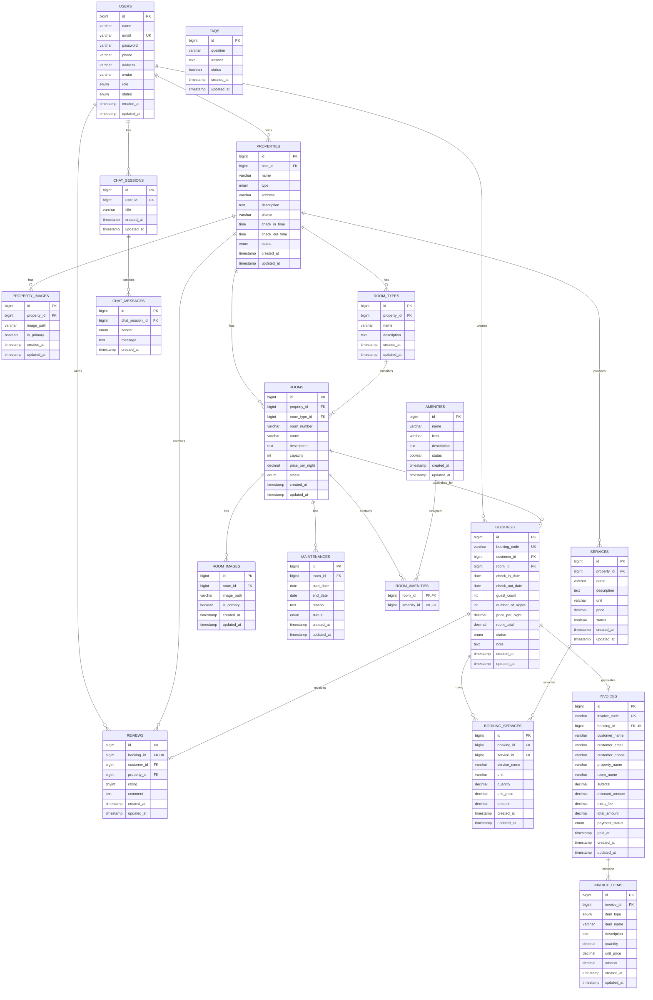
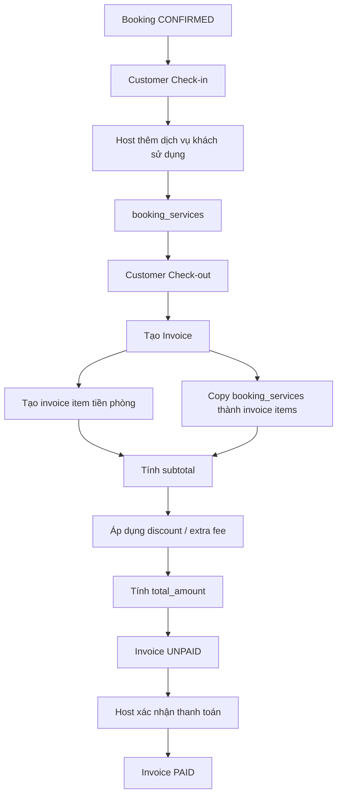

# StayHub - ERD V2 và Data Dictionary

## 1. Tổng quan

Phiên bản ERD này mở rộng hệ thống StayHub theo hướng thực tế hơn:

- Host quản lý khách sạn / homestay.
- Host quản lý phòng và loại phòng.
- Host quản lý các dịch vụ đi kèm.
- Customer đặt phòng.
- Trong thời gian lưu trú, khách có thể sử dụng thêm dịch vụ.
- Khi checkout, hệ thống tạo hóa đơn.
- Hóa đơn có nhiều dòng chi tiết thông qua `invoice_items`.

Luồng dữ liệu chính:

```text
PROPERTY
├── ROOMS
└── SERVICES

CUSTOMER
   ↓
BOOKING
   ├── ROOM
   └── BOOKING_SERVICES
            ↓
         SERVICES

BOOKING
   ↓
INVOICE
   ↓
INVOICE_ITEMS
```

---

# 2. ERD tổng thể



---

# 3. Giải thích từng bảng

## 3.1 `users`

Lưu tất cả tài khoản hệ thống.

| Trường | Kiểu gợi ý | Lưu gì |
|---|---|---|
| `id` | BIGINT | Khóa chính |
| `name` | VARCHAR(255) | Họ tên |
| `email` | VARCHAR(255), UNIQUE | Email đăng nhập |
| `password` | VARCHAR(255) | Mật khẩu đã hash |
| `phone` | VARCHAR(20) | Số điện thoại |
| `address` | VARCHAR(500), nullable | Địa chỉ |
| `avatar` | VARCHAR(500), nullable | Đường dẫn ảnh đại diện |
| `role` | ENUM | `ADMIN`, `HOST`, `CUSTOMER` |
| `status` | ENUM | `ACTIVE`, `INACTIVE`, `BLOCKED` |
| `created_at` | TIMESTAMP | Ngày tạo |
| `updated_at` | TIMESTAMP | Ngày cập nhật |

---

## 3.2 `properties`

Lưu khách sạn hoặc homestay.

| Trường | Kiểu gợi ý | Lưu gì |
|---|---|---|
| `id` | BIGINT | Khóa chính |
| `host_id` | BIGINT, FK | Host sở hữu cơ sở |
| `name` | VARCHAR(255) | Tên khách sạn / homestay |
| `type` | ENUM | `HOTEL`, `HOMESTAY` |
| `address` | VARCHAR(500) | Địa chỉ |
| `description` | TEXT | Mô tả |
| `phone` | VARCHAR(20) | SĐT liên hệ |
| `check_in_time` | TIME | Giờ check-in mặc định |
| `check_out_time` | TIME | Giờ check-out mặc định |
| `status` | ENUM | `ACTIVE`, `INACTIVE`, `BLOCKED`, có thể thêm `PENDING` |
| `created_at` | TIMESTAMP | Ngày tạo |
| `updated_at` | TIMESTAMP | Ngày cập nhật |

Quan hệ:

```text
users(HOST) 1 ---- N properties
```

---

## 3.3 `property_images`

Lưu ảnh cơ sở lưu trú.

| Trường | Kiểu gợi ý | Lưu gì |
|---|---|---|
| `id` | BIGINT | Khóa chính |
| `property_id` | BIGINT, FK | Cơ sở sở hữu ảnh |
| `image_path` | VARCHAR(500) | Path / URL ảnh |
| `is_primary` | BOOLEAN | Có phải ảnh chính |
| `created_at` | TIMESTAMP | Ngày thêm |
| `updated_at` | TIMESTAMP | Ngày cập nhật |

---

## 3.4 `room_types`

Lưu loại phòng riêng của từng property.

| Trường | Kiểu gợi ý | Lưu gì |
|---|---|---|
| `id` | BIGINT | Khóa chính |
| `property_id` | BIGINT, FK | Cơ sở sở hữu loại phòng |
| `name` | VARCHAR(255) | Standard, Deluxe, Family... |
| `description` | TEXT | Mô tả loại phòng |
| `created_at` | TIMESTAMP | Ngày tạo |
| `updated_at` | TIMESTAMP | Ngày cập nhật |

---

## 3.5 `rooms`

Lưu từng phòng cụ thể.

| Trường | Kiểu gợi ý | Lưu gì |
|---|---|---|
| `id` | BIGINT | Khóa chính |
| `property_id` | BIGINT, FK | Thuộc cơ sở nào |
| `room_type_id` | BIGINT, FK | Thuộc loại phòng nào |
| `room_number` | VARCHAR(50) | Mã phòng như `101`, `A01` |
| `name` | VARCHAR(255) | Tên hiển thị |
| `description` | TEXT | Mô tả phòng |
| `capacity` | INT | Sức chứa tối đa |
| `price_per_night` | DECIMAL(12,2) | Giá hiện tại mỗi đêm |
| `status` | ENUM | `ACTIVE`, `MAINTENANCE`, `INACTIVE` |
| `created_at` | TIMESTAMP | Ngày tạo |
| `updated_at` | TIMESTAMP | Ngày cập nhật |

Không lưu `BOOKED` làm status cố định. Availability được tính theo ngày.

---

## 3.6 `room_images`

Lưu nhiều ảnh cho một phòng.

| Trường | Kiểu gợi ý | Lưu gì |
|---|---|---|
| `id` | BIGINT | Khóa chính |
| `room_id` | BIGINT, FK | Phòng |
| `image_path` | VARCHAR(500) | Đường dẫn ảnh |
| `is_primary` | BOOLEAN | Ảnh chính hay không |
| `created_at` | TIMESTAMP | Ngày thêm |
| `updated_at` | TIMESTAMP | Ngày cập nhật |

---

## 3.7 `amenities`

Danh mục tiện nghi dùng chung.

Ví dụ:

```text
WiFi
TV
Air Conditioner
Parking
Swimming Pool
Private Bathroom
```

| Trường | Kiểu gợi ý | Lưu gì |
|---|---|---|
| `id` | BIGINT | Khóa chính |
| `name` | VARCHAR(255) | Tên tiện nghi |
| `icon` | VARCHAR(255), nullable | Tên icon / path icon |
| `description` | TEXT, nullable | Mô tả |
| `status` | BOOLEAN | Có đang dùng hay không |
| `created_at` | TIMESTAMP | Ngày tạo |
| `updated_at` | TIMESTAMP | Ngày cập nhật |

---

## 3.8 `room_amenities`

Bảng trung gian giữa Room và Amenity.

| Trường | Kiểu gợi ý | Lưu gì |
|---|---|---|
| `room_id` | BIGINT, FK | Phòng |
| `amenity_id` | BIGINT, FK | Tiện nghi |

Khóa chính:

```text
PRIMARY KEY(room_id, amenity_id)
```

---

## 3.9 `maintenances`

Lưu lịch bảo trì phòng.

| Trường | Kiểu gợi ý | Lưu gì |
|---|---|---|
| `id` | BIGINT | Khóa chính |
| `room_id` | BIGINT, FK | Phòng bảo trì |
| `start_date` | DATE | Ngày bắt đầu |
| `end_date` | DATE | Ngày kết thúc |
| `reason` | TEXT | Lý do |
| `status` | ENUM | `SCHEDULED`, `IN_PROGRESS`, `COMPLETED`, `CANCELLED` |
| `created_at` | TIMESTAMP | Ngày tạo |
| `updated_at` | TIMESTAMP | Ngày cập nhật |

---

# 4. Dịch vụ

## 4.1 `services`

Lưu các dịch vụ bổ sung mà từng property cung cấp.

Ví dụ:

```text
Breakfast
Laundry
Airport Pickup
Motorbike Rental
Extra Bed
Late Checkout
```

| Trường | Kiểu gợi ý | Lưu gì |
|---|---|---|
| `id` | BIGINT | Khóa chính |
| `property_id` | BIGINT, FK | Dịch vụ thuộc cơ sở nào |
| `name` | VARCHAR(255) | Tên dịch vụ |
| `description` | TEXT, nullable | Mô tả |
| `unit` | VARCHAR(50) | Đơn vị: `suất`, `kg`, `lượt`, `ngày`... |
| `price` | DECIMAL(12,2) | Giá hiện tại |
| `status` | BOOLEAN | Có đang cung cấp hay không |
| `created_at` | TIMESTAMP | Ngày tạo |
| `updated_at` | TIMESTAMP | Ngày cập nhật |

Ví dụ:

```text
Breakfast      | suất | 100000
Laundry        | kg   | 50000
Airport Pickup | lượt | 300000
```

---

# 5. Booking

## 5.1 `bookings`

Lưu một lần đặt phòng của Customer.

| Trường | Kiểu gợi ý | Lưu gì |
|---|---|---|
| `id` | BIGINT | Khóa chính |
| `booking_code` | VARCHAR(50), UNIQUE | Mã booking |
| `customer_id` | BIGINT, FK | Customer đặt |
| `room_id` | BIGINT, FK | Phòng được đặt |
| `check_in_date` | DATE | Ngày nhận phòng |
| `check_out_date` | DATE | Ngày trả phòng |
| `guest_count` | INT | Số khách |
| `number_of_nights` | INT | Số đêm |
| `price_per_night` | DECIMAL(12,2) | Snapshot giá phòng khi đặt |
| `room_total` | DECIMAL(12,2) | Tổng tiền phòng |
| `status` | ENUM | Trạng thái booking |
| `note` | TEXT, nullable | Ghi chú |
| `created_at` | TIMESTAMP | Ngày đặt |
| `updated_at` | TIMESTAMP | Ngày cập nhật |

Booking status:

```text
PENDING
CONFIRMED
CHECKED_IN
COMPLETED
CANCELLED
REJECTED
```

Công thức:

```text
room_total = number_of_nights × price_per_night
```

---

## 5.2 `booking_services`

Lưu dịch vụ thực tế khách sử dụng trong booking.

Đây là bảng quan trọng vì giá dịch vụ có thể thay đổi sau này.

| Trường | Kiểu gợi ý | Lưu gì |
|---|---|---|
| `id` | BIGINT | Khóa chính |
| `booking_id` | BIGINT, FK | Booking sử dụng dịch vụ |
| `service_id` | BIGINT, FK | Dịch vụ gốc |
| `service_name` | VARCHAR(255) | Snapshot tên dịch vụ |
| `unit` | VARCHAR(50) | Snapshot đơn vị |
| `quantity` | DECIMAL(10,2) | Số lượng thực tế |
| `unit_price` | DECIMAL(12,2) | Snapshot giá tại lúc dùng |
| `amount` | DECIMAL(12,2) | Thành tiền |
| `created_at` | TIMESTAMP | Thời điểm thêm |
| `updated_at` | TIMESTAMP | Ngày cập nhật |

Công thức:

```text
amount = quantity × unit_price
```

Ví dụ:

```text
Booking BK001
Breakfast | 2 suất | 100,000 | 200,000
Laundry   | 3 kg   | 50,000  | 150,000
```

---

# 6. Hóa đơn

## 6.1 `invoices`

Đây là phần `header` của hóa đơn.

Không lưu từng dịch vụ riêng trong bảng này.

| Trường | Kiểu gợi ý | Lưu gì |
|---|---|---|
| `id` | BIGINT | Khóa chính |
| `invoice_code` | VARCHAR(50), UNIQUE | Mã hóa đơn |
| `booking_id` | BIGINT, FK, UNIQUE | Booking liên quan |
| `customer_name` | VARCHAR(255) | Snapshot tên khách |
| `customer_email` | VARCHAR(255) | Snapshot email |
| `customer_phone` | VARCHAR(20) | Snapshot SĐT |
| `property_name` | VARCHAR(255) | Snapshot tên cơ sở |
| `room_name` | VARCHAR(255) | Snapshot tên phòng |
| `subtotal` | DECIMAL(12,2) | Tổng trước giảm/phụ thu |
| `discount_amount` | DECIMAL(12,2) | Số tiền giảm |
| `extra_fee` | DECIMAL(12,2) | Phụ phí khác nếu có |
| `total_amount` | DECIMAL(12,2) | Tổng thanh toán cuối |
| `payment_status` | ENUM | Trạng thái thanh toán |
| `paid_at` | TIMESTAMP, nullable | Thời điểm thanh toán |
| `created_at` | TIMESTAMP | Ngày lập hóa đơn |
| `updated_at` | TIMESTAMP | Ngày cập nhật |

Payment status:

```text
UNPAID
PAID
REFUNDED
```

Công thức:

```text
subtotal = SUM(invoice_items.amount)

total_amount =
subtotal
- discount_amount
+ extra_fee
```

---

## 6.2 `invoice_items`

Lưu từng dòng chi tiết của hóa đơn.

| Trường | Kiểu gợi ý | Lưu gì |
|---|---|---|
| `id` | BIGINT | Khóa chính |
| `invoice_id` | BIGINT, FK | Hóa đơn |
| `item_type` | ENUM | Loại dòng |
| `item_name` | VARCHAR(255) | Tên dòng hóa đơn |
| `description` | TEXT, nullable | Mô tả thêm |
| `quantity` | DECIMAL(10,2) | Số lượng |
| `unit_price` | DECIMAL(12,2) | Đơn giá |
| `amount` | DECIMAL(12,2) | Thành tiền |
| `created_at` | TIMESTAMP | Ngày tạo |
| `updated_at` | TIMESTAMP | Ngày cập nhật |

`item_type`:

```text
ROOM
SERVICE
SURCHARGE
DISCOUNT
OTHER
```

Ví dụ:

| item_type | item_name | quantity | unit_price | amount |
|---|---|---:|---:|---:|
| ROOM | Deluxe Room | 3 | 800000 | 2400000 |
| SERVICE | Breakfast | 2 | 100000 | 200000 |
| SERVICE | Laundry | 3 | 50000 | 150000 |
| SURCHARGE | Late checkout | 1 | 200000 | 200000 |

---

# 7. Review

## 7.1 `reviews`

| Trường | Kiểu gợi ý | Lưu gì |
|---|---|---|
| `id` | BIGINT | Khóa chính |
| `booking_id` | BIGINT, FK, UNIQUE | Booking được đánh giá |
| `customer_id` | BIGINT, FK | Customer đánh giá |
| `property_id` | BIGINT, FK | Cơ sở được đánh giá |
| `rating` | TINYINT | 1 - 5 sao |
| `comment` | TEXT | Nội dung |
| `created_at` | TIMESTAMP | Ngày tạo |
| `updated_at` | TIMESTAMP | Ngày cập nhật |

Business rule:

```text
booking.status = COMPLETED
```

và mỗi booking chỉ review một lần.

---

# 8. Chatbot

## 8.1 `faqs`

Lưu dữ liệu FAQ.

| Trường | Kiểu gợi ý | Lưu gì |
|---|---|---|
| `id` | BIGINT | Khóa chính |
| `question` | VARCHAR(500) | Câu hỏi |
| `answer` | TEXT | Câu trả lời |
| `status` | BOOLEAN | Có đang sử dụng |
| `created_at` | TIMESTAMP | Ngày tạo |
| `updated_at` | TIMESTAMP | Ngày cập nhật |

---

## 8.2 `chat_sessions`

| Trường | Kiểu gợi ý | Lưu gì |
|---|---|---|
| `id` | BIGINT | Khóa chính |
| `user_id` | BIGINT, FK, nullable | User chat |
| `title` | VARCHAR(255), nullable | Tên phiên |
| `created_at` | TIMESTAMP | Ngày tạo |
| `updated_at` | TIMESTAMP | Ngày cập nhật |

---

## 8.3 `chat_messages`

| Trường | Kiểu gợi ý | Lưu gì |
|---|---|---|
| `id` | BIGINT | Khóa chính |
| `chat_session_id` | BIGINT, FK | Phiên chat |
| `sender` | ENUM | `USER`, `ASSISTANT` |
| `message` | TEXT | Nội dung |
| `created_at` | TIMESTAMP | Thời gian gửi |

---

# 9. Luồng tạo hóa đơn



---

# 10. Business rules quan trọng

## Availability

Phòng khả dụng khi:

```text
rooms.status = ACTIVE
```

và không có booking bị trùng:

```text
existing.check_in_date < requested.check_out_date
AND
existing.check_out_date > requested.check_in_date
```

với status:

```text
PENDING
CONFIRMED
CHECKED_IN
```

và không trùng lịch bảo trì:

```text
maintenance.start_date < requested.check_out_date
AND
maintenance.end_date > requested.check_in_date
```

---

# 11. Các bảng cốt lõi

Nhóm 3 người nên làm trước:

```text
users
properties
property_images
room_types
rooms
room_images
amenities
room_amenities
maintenances
services
bookings
booking_services
invoices
invoice_items
reviews
```

Sau cùng mới làm:

```text
faqs
chat_sessions
chat_messages
```
