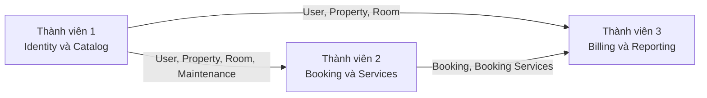

# StayHub - Phân công công việc nhóm 3 thành viên

Tài liệu này phân chia công việc theo các use case trong `stayhub-usecase-system.md`. Mỗi thành viên sở hữu một nhóm module xuyên suốt từ database, backend đến frontend và kiểm thử.

## 1. Nguyên tắc phân chia

Công việc được chia theo **vertical slice**. Mỗi thành viên chịu trách nhiệm trọn vẹn các use case thuộc module của mình:

```text
Database Migration
    -> Eloquent Model
    -> Form Request / Validation
    -> Policy / Authorization
    -> Service
    -> Controller
    -> API Resource
    -> Route
    -> Frontend Service
    -> Page / Component
    -> Testing
```

Mục tiêu:

- mỗi thành viên có phạm vi sở hữu rõ ràng;
- hạn chế nhiều người cùng chỉnh sửa một file;
- mỗi người có thể phát triển trên branch riêng;
- dùng factory, seeder hoặc mock API khi module phụ thuộc chưa hoàn thành;
- tích hợp thông qua API contract đã thống nhất.

### Phân chia tổng thể

| Thành viên | Module chính |
| --- | --- |
| Thành viên 1 | Authentication, User, Property, Room, Amenity, Maintenance |
| Thành viên 2 | Search, Availability, Booking, Booking Workflow, Services |
| Thành viên 3 | Invoice, Review, Dashboard, Admin Monitoring, Chatbot |

## 2. Công việc chung trước khi chia branch

Cả nhóm cần thống nhất các thành phần dùng chung trước khi phát triển độc lập.

### 2.1 Enum và trạng thái

```text
UserRole
- ADMIN
- HOST
- CUSTOMER

UserStatus
- ACTIVE
- BLOCKED

PropertyStatus
- ACTIVE
- INACTIVE

RoomStatus
- ACTIVE
- MAINTENANCE
- INACTIVE

BookingStatus
- PENDING
- CONFIRMED
- REJECTED
- CANCELLED
- CHECKED_IN
- COMPLETED

InvoiceStatus
- UNPAID
- PAID
- CANCELLED
```

### 2.2 API response

Response thành công:

```json
{
  "success": true,
  "message": "Operation completed successfully",
  "data": {}
}
```

Response danh sách:

```json
{
  "success": true,
  "data": [],
  "meta": {
    "current_page": 1,
    "last_page": 1,
    "per_page": 15,
    "total": 0
  }
}
```

Response lỗi:

```json
{
  "success": false,
  "message": "The given data was invalid.",
  "errors": {}
}
```

### 2.3 Quy ước route

```text
/api/public/*
/api/customer/*
/api/host/*
/api/admin/*
```

### 2.4 Quy ước Git branch

```text
feature/member-1-catalog
feature/member-2-booking
feature/member-3-billing
```

Không phát triển trực tiếp trên `main`.

## 3. Thành viên 1 - Identity và Property Catalog

### 3.1 Phạm vi phụ trách

Thành viên 1 chịu trách nhiệm nền tảng người dùng và dữ liệu cơ sở lưu trú.

### 3.2 Use case được giao

```text
UC1  - Đăng ký
UC2  - Đăng nhập / Đăng xuất
UC3  - Quản lý hồ sơ cá nhân

UC4  - Xem danh sách cơ sở lưu trú
UC5  - Xem chi tiết cơ sở
UC7  - Lọc phòng
UC8  - Xem chi tiết phòng

UC18 - Quản lý cơ sở lưu trú
UC19 - Quản lý loại phòng
UC20 - Quản lý phòng
UC21 - Quản lý hình ảnh phòng
UC22 - Quản lý tiện nghi
UC23 - Quản lý lịch bảo trì

UC40 - Quản lý Customer
UC41 - Quản lý Host
UC42 - Khóa / mở tài khoản
UC43 - Giám sát cơ sở lưu trú
UC46 - Quản lý danh mục tiện nghi

UC51 - Kiểm tra lịch bảo trì
UC52 - Kiểm tra sức chứa
```

`UC51` và `UC52` do Thành viên 1 xây dựng phần truy vấn hoặc hàm kiểm tra, sau đó Thành viên 2 sử dụng trong `AvailabilityService`.

### 3.3 Database và model phụ trách

Các bảng:

```text
users
properties
property_images
room_types
rooms
room_images
amenities
room_amenities
maintenances
```

Các model:

```text
User
Property
PropertyImage
RoomType
Room
RoomImage
Amenity
Maintenance
```

### 3.4 Backend phụ trách

```text
Authentication
Profile
Role middleware
Account status middleware
Property CRUD
Property Images
Room Type CRUD
Room CRUD
Room Images
Amenity CRUD
Room - Amenity assignment
Maintenance CRUD
Property ownership policy
Room ownership policy
Public property catalog API
Public room detail API
```

Service dự kiến:

```text
AuthService
PropertyService
RoomTypeService
RoomService
AmenityService
MaintenanceService
```

### 3.5 API chính

```text
POST   /register
POST   /login
POST   /logout
GET    /api/me
PUT    /api/profile

GET    /api/public/properties
GET    /api/public/properties/{property}
GET    /api/public/rooms/{room}
GET    /api/public/amenities

GET    /api/host/properties
POST   /api/host/properties
GET    /api/host/properties/{property}
PUT    /api/host/properties/{property}
PATCH  /api/host/properties/{property}/status

GET    /api/host/properties/{property}/room-types
POST   /api/host/properties/{property}/room-types
PUT    /api/host/room-types/{roomType}

GET    /api/host/properties/{property}/rooms
POST   /api/host/properties/{property}/rooms
GET    /api/host/rooms/{room}
PUT    /api/host/rooms/{room}
PATCH  /api/host/rooms/{room}/status

GET    /api/host/rooms/{room}/maintenances
POST   /api/host/rooms/{room}/maintenances
PUT    /api/host/maintenances/{maintenance}
DELETE /api/host/maintenances/{maintenance}

GET    /api/admin/users
PATCH  /api/admin/users/{user}/status
GET    /api/admin/properties
GET    /api/admin/amenities
POST   /api/admin/amenities
PUT    /api/admin/amenities/{amenity}
```

### 3.6 Frontend phụ trách

```text
Đăng ký
Đăng nhập
Thông tin cá nhân
Danh sách cơ sở lưu trú
Chi tiết cơ sở
Chi tiết phòng
Host Property List
Host Property Form
Host Room Type Management
Host Room Management
Host Room Form
Host Maintenance Management
Admin User Management
Admin Property Monitoring
Admin Amenity Management
```

Frontend service dự kiến:

```text
authService.js
profileService.js
propertyService.js
roomTypeService.js
roomService.js
amenityService.js
maintenanceService.js
adminUserService.js
```

### 3.7 Business rule cần bảo đảm

- email không được trùng;
- mật khẩu phải được hash;
- tài khoản bị khóa không được tiếp tục sử dụng hệ thống;
- Host chỉ được sửa Property thuộc mình;
- Host chỉ được sửa Room thuộc Property của mình;
- Room Type phải thuộc đúng Property;
- lịch bảo trì phải thuộc đúng Room;
- không tạo khoảng bảo trì có ngày kết thúc trước ngày bắt đầu;
- dữ liệu public không trả về Property hoặc Room đã ngưng hoạt động;
- Admin quản lý danh mục Amenity toàn hệ thống;
- Host chỉ gán Amenity đã tồn tại vào Room.

### 3.8 Kết quả bàn giao

```text
Migration và seeder dữ liệu nền
Authentication hoạt động với Sanctum
Role và account status middleware
Property/Room/Amenity/Maintenance API
Giao diện quản lý Property và Room
Public Property/Room pages
Admin User/Property/Amenity pages
Feature tests cho authentication và ownership
API documentation cho module
```

## 4. Thành viên 2 - Search, Booking và Service Operations

### 4.1 Phạm vi phụ trách

Thành viên 2 chịu trách nhiệm toàn bộ vòng đời tìm phòng, đặt phòng và vận hành booking.

### 4.2 Use case được giao

```text
UC6  - Tìm kiếm phòng trống
UC9  - Đặt phòng
UC10 - Xem tổng tiền phòng
UC11 - Xem lịch sử booking
UC12 - Xem chi tiết booking
UC13 - Hủy booking
UC14 - Xem dịch vụ đã sử dụng

UC24 - Quản lý dịch vụ
UC25 - Thêm dịch vụ vào booking
UC26 - Cập nhật số lượng dịch vụ
UC27 - Xóa dịch vụ khỏi booking

UC28 - Xem booking của cơ sở
UC29 - Xem chi tiết booking
UC30 - Xác nhận booking
UC31 - Từ chối booking
UC32 - Check-in
UC33 - Check-out

UC49 - Kiểm tra Availability
UC50 - Kiểm tra booking bị trùng
UC53 - Tính số đêm
UC54 - Tính tiền phòng
UC55 - Tính tiền dịch vụ
UC59 - Kiểm tra điều kiện hủy
```

### 4.3 Database và model phụ trách

Các bảng:

```text
services
bookings
booking_services
```

Các model:

```text
Service
Booking
BookingService
```

### 4.4 Backend phụ trách

```text
Search room
Room availability
Booking creation
Customer booking history
Customer booking cancellation
Host booking management
Booking state transitions
Property service management
Booking service management
Room price calculation
Service price calculation
Booking transaction và concurrency
```

Service dự kiến:

```text
SearchService
AvailabilityService
BookingService
BookingWorkflowService
PropertyServiceManagementService
BookingServiceManagementService
PricingService
```

Tên `PropertyServiceManagementService` có thể thay đổi để tránh nhầm với `PropertyService` của Thành viên 1.

### 4.5 API chính

```text
GET    /api/public/rooms/search
GET    /api/public/rooms/{room}/availability
POST   /api/public/bookings/preview

POST   /api/customer/bookings
GET    /api/customer/bookings
GET    /api/customer/bookings/{booking}
POST   /api/customer/bookings/{booking}/cancel
GET    /api/customer/bookings/{booking}/services

GET    /api/host/services
POST   /api/host/services
PUT    /api/host/services/{service}
PATCH  /api/host/services/{service}/status

GET    /api/host/bookings
GET    /api/host/bookings/{booking}
POST   /api/host/bookings/{booking}/confirm
POST   /api/host/bookings/{booking}/reject
POST   /api/host/bookings/{booking}/check-in
POST   /api/host/bookings/{booking}/check-out

GET    /api/host/bookings/{booking}/services
POST   /api/host/bookings/{booking}/services
PUT    /api/host/bookings/{booking}/services/{bookingService}
DELETE /api/host/bookings/{booking}/services/{bookingService}
```

### 4.6 Frontend phụ trách

```text
Search Result Page
Bộ lọc phòng
Kiểm tra ngày trống
Booking Checkout
Hiển thị tổng tiền dự kiến
My Bookings
Customer Booking Detail
Hủy booking
Host Service Management
Host Booking List
Host Booking Detail
Confirm / Reject Booking
Check-in / Check-out
Add Service to Booking
Update / Remove Booking Service
```

Frontend service dự kiến:

```text
searchService.js
availabilityService.js
bookingService.js
hostBookingService.js
propertyServiceCatalogService.js
bookingServiceUsageService.js
```

### 4.7 Business rule cần bảo đảm

#### Availability

Phòng được xem là trống khi:

```text
Room status = ACTIVE
AND đủ sức chứa
AND không trùng lịch bảo trì
AND không trùng booking đang giữ phòng
```

Điều kiện hai khoảng thời gian giao nhau:

```text
existing_check_in < requested_check_out
AND
existing_check_out > requested_check_in
```

Booking giữ phòng:

```text
PENDING
CONFIRMED
CHECKED_IN
```

Booking không giữ phòng:

```text
REJECTED
CANCELLED
COMPLETED
```

#### Booking

- `check_out` phải lớn hơn `check_in`;
- số khách không vượt quá sức chứa;
- giá phòng phải lấy từ database;
- lưu snapshot giá tại thời điểm đặt;
- tổng tiền phải do backend tính;
- kiểm tra lại availability trong transaction trước khi tạo;
- không tin `price`, `number_of_nights` hoặc `total` từ frontend;
- Customer chỉ xem và hủy booking của mình;
- Host chỉ xử lý booking thuộc Property của mình.

#### Workflow

```text
PENDING -> CONFIRMED
PENDING -> REJECTED
PENDING -> CANCELLED
CONFIRMED -> CHECKED_IN
CONFIRMED -> CANCELLED
CHECKED_IN -> COMPLETED
```

Không cho phép cập nhật trực tiếp status tùy ý.

#### Booking Services

- Service phải thuộc Property của Booking;
- chỉ Host sở hữu Property mới được thêm dịch vụ;
- chỉ thêm dịch vụ khi Booking ở trạng thái cho phép;
- lưu snapshot `service_name`, `unit`, `unit_price`;
- `amount = quantity × unit_price`;
- cập nhật quantity phải tính lại amount.

### 4.8 Kết quả bàn giao

```text
Search và Availability API
Booking API và workflow
Property Service CRUD
Booking Service CRUD
Customer booking pages
Host booking/service pages
Transaction chống đặt trùng phòng
Feature tests cho booking workflow
Feature tests cho role và ownership
API documentation cho module
```

## 5. Thành viên 3 - Billing, Review, Dashboard và Chatbot

### 5.1 Phạm vi phụ trách

Thành viên 3 chịu trách nhiệm phần sau lưu trú, hóa đơn, báo cáo và chức năng nâng cao.

### 5.2 Use case được giao

```text
UC15 - Xem hóa đơn cá nhân
UC16 - Đánh giá / Review
UC17 - Chat với chatbot

UC34 - Tạo hóa đơn từ booking
UC35 - Xem chi tiết hóa đơn
UC36 - Cập nhật trạng thái thanh toán
UC37 - Quản lý hóa đơn
UC38 - Xem review
UC39 - Xem dashboard Host

UC44 - Xem toàn bộ booking
UC45 - Xem toàn bộ hóa đơn
UC47 - Xem dashboard Admin
UC48 - Xem thống kê hệ thống

UC56 - Tạo chi tiết hóa đơn
UC57 - Tính subtotal
UC58 - Tính tổng thanh toán
UC60 - Kiểm tra điều kiện review
UC61 - Lấy dữ liệu nội bộ cho chatbot
```

### 5.3 Database và model phụ trách

Các bảng:

```text
invoices
invoice_items
reviews
faqs
chat_sessions
chat_messages
```

Các model:

```text
Invoice
InvoiceItem
Review
Faq
ChatSession
ChatMessage
```

### 5.4 Backend phụ trách

```text
Invoice creation
Invoice item generation
Invoice calculation
Payment status
Customer invoice access
Host invoice management
Review validation
Review creation
Host review list
Host dashboard
Admin booking/invoice monitoring
Admin dashboard
System statistics
FAQ management
Chatbot context retrieval
Chat history
AI/LLM integration
```

Service dự kiến:

```text
InvoiceService
InvoiceCalculationService
ReviewService
HostDashboardService
AdminDashboardService
StatisticsService
ChatbotService
ChatContextService
```

### 5.5 API chính

```text
GET    /api/customer/invoices
GET    /api/customer/invoices/{invoice}

POST   /api/customer/bookings/{booking}/review
GET    /api/public/properties/{property}/reviews

GET    /api/customer/chat/sessions
POST   /api/customer/chat/sessions
GET    /api/customer/chat/sessions/{chatSession}/messages
POST   /api/customer/chat/sessions/{chatSession}/messages

GET    /api/host/invoices
POST   /api/host/bookings/{booking}/invoice
GET    /api/host/invoices/{invoice}
PATCH  /api/host/invoices/{invoice}/payment-status
GET    /api/host/reviews
GET    /api/host/dashboard

GET    /api/admin/bookings
GET    /api/admin/invoices
GET    /api/admin/dashboard
GET    /api/admin/statistics

GET    /api/admin/faqs
POST   /api/admin/faqs
PUT    /api/admin/faqs/{faq}
DELETE /api/admin/faqs/{faq}
```

### 5.6 Frontend phụ trách

```text
Customer Invoice Detail
Customer Review Form
Property Review List
Chatbot UI
Chat History
Host Invoice List
Host Invoice Detail
Host Review List
Host Dashboard
Admin Global Booking List
Admin Global Invoice List
Admin Dashboard
Admin Statistics
Admin FAQ Management
```

Frontend service dự kiến:

```text
invoiceService.js
reviewService.js
hostDashboardService.js
adminDashboardService.js
statisticsService.js
chatbotService.js
faqService.js
```

### 5.7 Business rule cần bảo đảm

#### Invoice

- chỉ tạo hóa đơn từ Booking hợp lệ;
- một Booking có tối đa một Invoice;
- tiền phòng lấy từ snapshot trong Booking;
- tiền dịch vụ lấy từ snapshot trong `booking_services`;
- không lấy lại giá hiện tại từ Room hoặc Service;
- Invoice và Invoice Items phải được tạo trong transaction;
- frontend không được gửi tổng tiền cuối cùng để backend lưu trực tiếp;
- Host chỉ xem hóa đơn thuộc Property của mình;
- Customer chỉ xem hóa đơn thuộc Booking của mình;
- Admin được xem toàn bộ nhưng không thay Host vận hành booking.

Công thức:

```text
room_total = number_of_nights × booking.price_per_night
service_total = tổng booking_services.amount
subtotal = room_total + service_total
total = subtotal - discount + extra_fee
```

#### Review

- Booking phải ở trạng thái `COMPLETED`;
- Booking phải thuộc Customer hiện tại;
- mỗi Booking chỉ được đánh giá một lần;
- rating nằm trong khoảng `1..5`;
- Host không được sửa nội dung review của Customer.

#### Dashboard

- Host chỉ thống kê dữ liệu thuộc Property của mình;
- Admin thống kê toàn hệ thống;
- doanh thu phải lấy từ Invoice hợp lệ;
- cần thống nhất Invoice status nào được tính vào doanh thu;
- các endpoint dashboard chỉ đọc dữ liệu, không thay đổi nghiệp vụ.

#### Chatbot

- chatbot chỉ truy vấn dữ liệu được phép;
- không gửi dữ liệu nhạy cảm của người dùng cho AI/LLM;
- không cho chatbot trực tiếp sửa database;
- chatbot V1 không tạo, hủy hoặc sửa Booking;
- câu trả lời phải dựa trên Property, Room, Amenity, Service và FAQ;
- cần xử lý timeout hoặc lỗi từ AI/LLM;
- có thể dùng mock response nếu chưa cấu hình dịch vụ AI thật.

### 5.8 Kết quả bàn giao

```text
Invoice API và giao diện
Invoice calculation tests
Review API và giao diện
Host/Admin dashboards
Admin monitoring pages
Chatbot và FAQ API
Chatbot UI
Feature tests cho quyền truy cập invoice/review
API documentation cho module
```

## 6. Ranh giới sở hữu mã nguồn

Để hạn chế conflict, mỗi thành viên chịu trách nhiệm chính cho các file thuộc module của mình.

### 6.1 Thành viên 1

```text
backend/app/Models/
- User.php
- Property.php
- PropertyImage.php
- RoomType.php
- Room.php
- RoomImage.php
- Amenity.php
- Maintenance.php

frontend/src/services/
- authService.js
- propertyService.js
- roomService.js
- amenityService.js
- maintenanceService.js
```

### 6.2 Thành viên 2

```text
backend/app/Models/
- Service.php
- Booking.php
- BookingService.php

frontend/src/services/
- searchService.js
- availabilityService.js
- bookingService.js
- hostBookingService.js
```

### 6.3 Thành viên 3

```text
backend/app/Models/
- Invoice.php
- InvoiceItem.php
- Review.php
- Faq.php
- ChatSession.php
- ChatMessage.php

frontend/src/services/
- invoiceService.js
- reviewService.js
- dashboardService.js
- chatbotService.js
```

Các file dùng chung cần có một người chịu trách nhiệm merge:

```text
backend/routes/api.php
backend/bootstrap/app.php
frontend/src/routes/AppRouter.jsx
frontend/src/api/axios.js
```

Đề xuất Thành viên 1 quản lý các file dùng chung. Thành viên 2 và Thành viên 3 cung cấp route/component cần thêm dưới dạng file riêng để Thành viên 1 import vào.

## 7. Cách tổ chức để làm việc độc lập

### 7.1 Tách route backend theo module

```text
backend/routes/
├── api.php
└── api/
    ├── auth.php
    ├── catalog.php
    ├── booking.php
    ├── billing.php
    ├── dashboard.php
    └── chatbot.php
```

`routes/api.php` chỉ import các route module:

```php
require __DIR__.'/api/auth.php';
require __DIR__.'/api/catalog.php';
require __DIR__.'/api/booking.php';
require __DIR__.'/api/billing.php';
require __DIR__.'/api/dashboard.php';
require __DIR__.'/api/chatbot.php';
```

Quyền sở hữu:

```text
auth.php, catalog.php       -> Thành viên 1
booking.php                 -> Thành viên 2
billing.php                 -> Thành viên 3
dashboard.php, chatbot.php  -> Thành viên 3
```

### 7.2 Tách frontend route theo module

```text
frontend/src/routes/
├── AppRouter.jsx
├── PublicRoutes.jsx
├── CustomerRoutes.jsx
├── HostRoutes.jsx
└── AdminRoutes.jsx
```

Mỗi thành viên tạo page trong đúng thư mục. Người quản lý `AppRouter.jsx` thực hiện import khi tích hợp.

### 7.3 Dùng API contract thay vì chờ nhau

Nếu module phụ thuộc chưa hoàn thành:

- Thành viên 2 dùng seeder tạo `User`, `Property` và `Room`;
- Thành viên 3 dùng seeder tạo `Booking` và `BookingService`;
- frontend dùng mock JSON có cùng schema với API contract;
- không tự tạo schema khác với phần đã thống nhất;
- khi API thật hoàn thành chỉ thay nguồn dữ liệu, không viết lại giao diện.

## 8. Quan hệ phụ thuộc giữa các thành viên



Các thành viên vẫn có thể phát triển đồng thời:

- Thành viên 2 dùng factory/seeder cho dữ liệu của Thành viên 1;
- Thành viên 3 dùng factory/seeder cho dữ liệu của Thành viên 2;
- frontend phát triển bằng mock API;
- chỉ tích hợp sau khi API contract đã được chốt.

## 9. Thứ tự migration và tích hợp

### Giai đoạn 1 - Nền tảng

Thành viên 1 hoàn thành trước:

```text
users
properties
room_types
rooms
amenities
maintenances
Authentication
RBAC
```

Trong thời gian đó, Thành viên 2 và Thành viên 3 vẫn phát triển service, controller, frontend và test bằng factory/mock.

### Giai đoạn 2 - Booking

Thành viên 2 tích hợp:

```text
services
bookings
booking_services
availability
booking workflow
```

### Giai đoạn 3 - Billing và chức năng sau booking

Thành viên 3 tích hợp:

```text
invoices
invoice_items
reviews
dashboard
chatbot
```

### Giai đoạn 4 - Tích hợp toàn hệ thống

```text
Customer đặt phòng
    -> Host xác nhận
    -> Host check-in
    -> Host thêm dịch vụ
    -> Host check-out
    -> Tạo hóa đơn
    -> Cập nhật thanh toán
    -> Customer review
```

## 10. Definition of Done

Một use case chỉ được xem là hoàn thành khi có đủ:

- migration và model nếu use case cần dữ liệu mới;
- validation;
- authentication và authorization;
- kiểm tra role và ownership;
- service xử lý nghiệp vụ;
- controller và API Resource;
- route API;
- frontend service;
- page/component;
- loading state;
- empty state;
- error state;
- feature test cho luồng thành công;
- test cho validation;
- test cho quyền truy cập;
- không có lỗi lint hoặc build;
- tài liệu endpoint và request/response mẫu.

Các lệnh cần chạy trước khi merge:

```bash
cd backend
php artisan test
```

```bash
cd frontend
npm run lint
npm run build
```

## 11. Checklist tích hợp cuối cùng

### Authentication

- [ ] Customer, Host và Admin đăng nhập được.
- [ ] Tài khoản bị khóa không truy cập được.
- [ ] API trả đúng `401` và `403`.

### Property và Room

- [ ] Host chỉ quản lý dữ liệu thuộc mình.
- [ ] Customer chỉ thấy dữ liệu đang hoạt động.
- [ ] Room có Room Type, Amenity và Maintenance chính xác.

### Booking

- [ ] Tìm kiếm loại trừ phòng đã đặt.
- [ ] Tìm kiếm loại trừ phòng đang bảo trì.
- [ ] Không thể tạo hai booking trùng nhau.
- [ ] Workflow không cho chuyển trạng thái sai.
- [ ] Giá được snapshot tại thời điểm đặt.

### Services

- [ ] Chỉ thêm dịch vụ của đúng Property.
- [ ] Giá dịch vụ được snapshot.
- [ ] Amount được backend tính lại.

### Invoice

- [ ] Mỗi Booking chỉ có một Invoice.
- [ ] Invoice Items khớp với tiền phòng và dịch vụ.
- [ ] Total được backend tính.
- [ ] Customer chỉ xem hóa đơn của mình.

### Review

- [ ] Chỉ Booking `COMPLETED` mới được review.
- [ ] Một Booking không thể review hai lần.

### Dashboard

- [ ] Dashboard Host chỉ chứa dữ liệu của Host.
- [ ] Dashboard Admin chứa dữ liệu toàn hệ thống.
- [ ] Doanh thu được tính từ đúng trạng thái Invoice.

### Chatbot

- [ ] Không làm lộ dữ liệu riêng tư.
- [ ] Không cho phép chatbot thay đổi dữ liệu.
- [ ] Có xử lý lỗi khi AI/LLM không phản hồi.

## 12. Kết luận

Việc chia module không thể loại bỏ hoàn toàn phụ thuộc dữ liệu vì Booking cần Room và Invoice cần Booking. Tuy nhiên, ba thành viên vẫn có thể phát triển song song bằng factory, seeder, mock API và API contract đã thống nhất.

Thứ tự phụ thuộc khi tích hợp:

```text
Thành viên 1
Identity + Property Catalog
        ↓
Thành viên 2
Search + Booking + Services
        ↓
Thành viên 3
Invoice + Review + Dashboard + Chatbot
```
