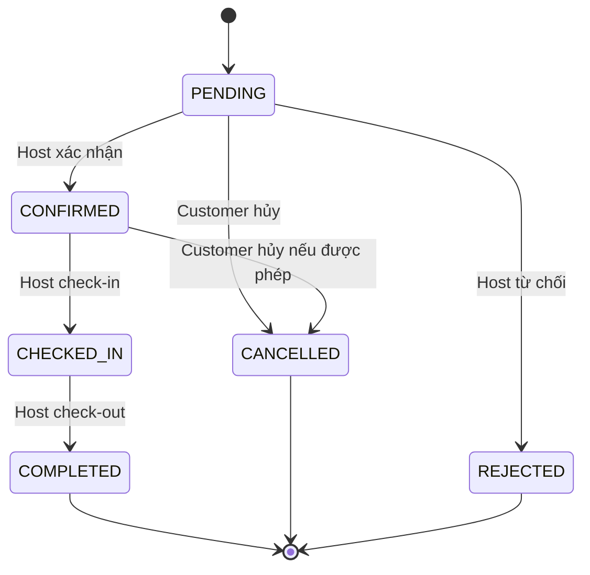
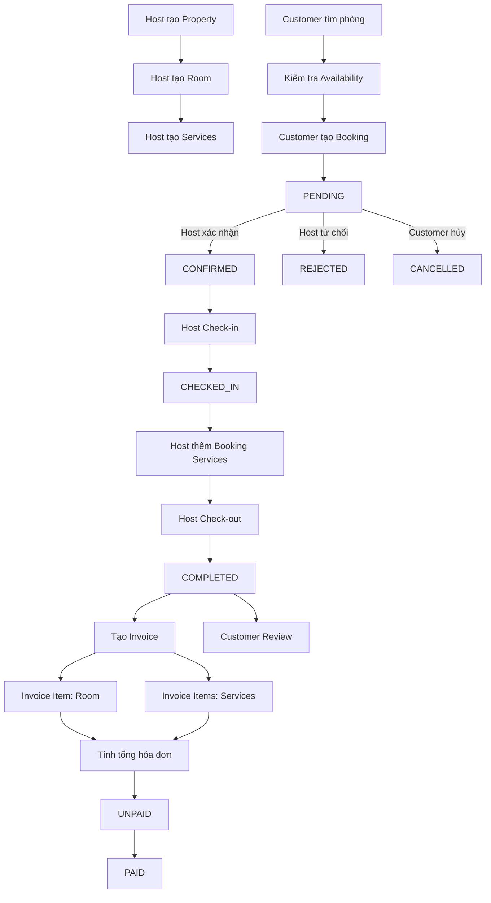

# StayHub - Use Case System V2

## 1. Tổng quan hệ thống

**StayHub** là hệ thống quản lý và đặt phòng khách sạn / homestay theo mô hình đa chủ cơ sở.

Hệ thống có các actor:

- **Admin**: quản trị toàn bộ hệ thống.
- **Host**: chủ khách sạn / homestay, quản lý cơ sở, phòng, dịch vụ, booking và hóa đơn.
- **Customer**: khách hàng tìm kiếm, đặt phòng, theo dõi booking, sử dụng dịch vụ và xem hóa đơn.
- **AI / LLM Service**: hệ thống ngoài hỗ trợ chatbot trả lời dựa trên dữ liệu nội bộ.

---

# 2. Use Case System tổng thể

```mermaid
flowchart LR
    C[Customer]
    H[Host]
    A[Admin]
    AI[AI / LLM Service]

    subgraph SYS[StayHub System]

        %% AUTH / PROFILE
        UC1([Đăng ký])
        UC2([Đăng nhập / Đăng xuất])
        UC3([Quản lý hồ sơ cá nhân])

        %% CUSTOMER
        UC4([Xem danh sách cơ sở lưu trú])
        UC5([Xem chi tiết cơ sở])
        UC6([Tìm kiếm phòng trống])
        UC7([Lọc phòng])
        UC8([Xem chi tiết phòng])
        UC9([Đặt phòng])
        UC10([Xem tổng tiền phòng])
        UC11([Xem lịch sử booking])
        UC12([Xem chi tiết booking])
        UC13([Hủy booking])
        UC14([Xem dịch vụ đã sử dụng])
        UC15([Xem hóa đơn cá nhân])
        UC16([Đánh giá / Review])
        UC17([Chat với chatbot])

        %% HOST - PROPERTY / ROOM
        UC18([Quản lý cơ sở lưu trú])
        UC19([Quản lý loại phòng])
        UC20([Quản lý phòng])
        UC21([Quản lý hình ảnh phòng])
        UC22([Quản lý tiện nghi])
        UC23([Quản lý lịch bảo trì])

        %% HOST - SERVICES
        UC24([Quản lý dịch vụ])
        UC25([Thêm dịch vụ vào booking])
        UC26([Cập nhật số lượng dịch vụ])
        UC27([Xóa dịch vụ khỏi booking])

        %% HOST - BOOKING
        UC28([Xem booking của cơ sở])
        UC29([Xem chi tiết booking])
        UC30([Xác nhận booking])
        UC31([Từ chối booking])
        UC32([Check-in])
        UC33([Check-out])

        %% HOST - INVOICE
        UC34([Tạo hóa đơn từ booking])
        UC35([Xem chi tiết hóa đơn])
        UC36([Cập nhật trạng thái thanh toán])
        UC37([Quản lý hóa đơn])

        %% HOST OTHER
        UC38([Xem review])
        UC39([Xem dashboard Host])

        %% ADMIN
        UC40([Quản lý Customer])
        UC41([Quản lý Host])
        UC42([Khóa / mở tài khoản])
        UC43([Giám sát cơ sở lưu trú])
        UC44([Xem toàn bộ booking])
        UC45([Xem toàn bộ hóa đơn])
        UC46([Quản lý danh mục tiện nghi])
        UC47([Xem dashboard Admin])
        UC48([Xem thống kê hệ thống])

        %% INTERNAL / INCLUDED USE CASES
        UC49([Kiểm tra Availability])
        UC50([Kiểm tra booking bị trùng])
        UC51([Kiểm tra lịch bảo trì])
        UC52([Kiểm tra sức chứa])
        UC53([Tính số đêm])
        UC54([Tính tiền phòng])
        UC55([Tính tiền dịch vụ])
        UC56([Tạo chi tiết hóa đơn])
        UC57([Tính subtotal])
        UC58([Tính tổng thanh toán])
        UC59([Kiểm tra điều kiện hủy])
        UC60([Kiểm tra điều kiện review])
        UC61([Lấy dữ liệu nội bộ cho chatbot])
    end

    %% CUSTOMER LINKS
    C --> UC1
    C --> UC2
    C --> UC3
    C --> UC4
    C --> UC5
    C --> UC6
    C --> UC7
    C --> UC8
    C --> UC9
    C --> UC11
    C --> UC12
    C --> UC13
    C --> UC14
    C --> UC15
    C --> UC16
    C --> UC17

    %% HOST LINKS
    H --> UC2
    H --> UC3
    H --> UC18
    H --> UC19
    H --> UC20
    H --> UC21
    H --> UC22
    H --> UC23

    H --> UC24
    H --> UC25
    H --> UC26
    H --> UC27

    H --> UC28
    H --> UC29
    H --> UC30
    H --> UC31
    H --> UC32
    H --> UC33

    H --> UC34
    H --> UC35
    H --> UC36
    H --> UC37

    H --> UC38
    H --> UC39

    %% ADMIN LINKS
    A --> UC2
    A --> UC40
    A --> UC41
    A --> UC42
    A --> UC43
    A --> UC44
    A --> UC45
    A --> UC46
    A --> UC47
    A --> UC48

    %% INCLUDE RELATIONSHIPS
    UC6 -. include .-> UC49
    UC49 -. include .-> UC50
    UC49 -. include .-> UC51
    UC49 -. include .-> UC52

    UC9 -. include .-> UC49
    UC9 -. include .-> UC53
    UC9 -. include .-> UC54
    UC9 -. include .-> UC10

    UC13 -. include .-> UC59

    UC25 -. include .-> UC55
    UC26 -. include .-> UC55

    UC34 -. include .-> UC54
    UC34 -. include .-> UC55
    UC34 -. include .-> UC56
    UC34 -. include .-> UC57
    UC34 -. include .-> UC58

    UC16 -. include .-> UC60

    UC17 -. include .-> UC61
    UC61 --> AI
```



---

# 3. Actor Customer

Customer là người tìm kiếm, đặt phòng và sử dụng hệ thống.

## Use Case của Customer

1. Đăng ký.
2. Đăng nhập / đăng xuất.
3. Quản lý hồ sơ cá nhân.
4. Xem danh sách khách sạn / homestay.
5. Xem chi tiết cơ sở.
6. Tìm kiếm phòng trống.
7. Lọc phòng theo:
   - giá;
   - loại phòng;
   - sức chứa;
   - tiện nghi.
8. Xem chi tiết phòng.
9. Đặt phòng.
10. Xem tổng tiền phòng dự kiến.
11. Xem lịch sử booking.
12. Xem chi tiết booking.
13. Hủy booking.
14. Xem các dịch vụ đã sử dụng trong booking.
15. Xem hóa đơn cá nhân.
16. Đánh giá sau khi hoàn thành booking.
17. Chat với chatbot.

---

# 4. Actor Host

Host là chủ khách sạn / homestay.

## 4.1 Quản lý cơ sở

Host có thể:

- thêm cơ sở;
- sửa cơ sở;
- xem chi tiết;
- cập nhật trạng thái;
- quản lý ảnh cơ sở.

---

## 4.2 Quản lý loại phòng

Host có thể:

- thêm loại phòng;
- sửa loại phòng;
- xóa / ngưng sử dụng;
- xem danh sách loại phòng.

---

## 4.3 Quản lý phòng

Host có thể:

- thêm phòng;
- sửa phòng;
- cập nhật giá;
- cập nhật sức chứa;
- cập nhật trạng thái;
- quản lý hình ảnh;
- gán tiện nghi;
- quản lý lịch bảo trì.

---

## 4.4 Quản lý dịch vụ

Đây là phần được bổ sung trong V2.

Host có thể:

- xem danh sách dịch vụ;
- thêm dịch vụ;
- sửa dịch vụ;
- thay đổi giá;
- thay đổi đơn vị tính;
- bật / tắt dịch vụ.

Ví dụ:

```text
Breakfast
Laundry
Airport Pickup
Motorbike Rental
Extra Bed
Late Checkout
```

---

## 4.5 Quản lý dịch vụ đã sử dụng của Booking

Sau khi Customer đã check-in, Host có thể thêm dịch vụ khách sử dụng.

Ví dụ:

```text
Booking BK001

Breakfast
2 suất × 100,000
= 200,000

Laundry
3 kg × 50,000
= 150,000
```

Use Case:

- Thêm dịch vụ vào booking.
- Cập nhật số lượng dịch vụ.
- Xóa dịch vụ khỏi booking.
- Xem các dịch vụ khách đã sử dụng.

---

## 4.6 Quản lý Booking

Host có thể:

- xem booking;
- xem chi tiết;
- xác nhận;
- từ chối;
- check-in;
- check-out.

Workflow:



---

# 5. Actor Admin

Admin quản trị toàn bộ hệ thống.

Use Case:

1. Đăng nhập.
2. Quản lý Customer.
3. Quản lý Host.
4. Khóa / mở tài khoản.
5. Giám sát cơ sở lưu trú.
6. Xem toàn bộ booking.
7. Xem toàn bộ hóa đơn.
8. Quản lý danh mục tiện nghi.
9. Xem dashboard.
10. Xem thống kê hệ thống.

Admin không trực tiếp vận hành booking hằng ngày thay Host.

---

# 6. Use Case tìm kiếm phòng trống

## Actor

Customer.

## Include

```text
Tìm kiếm phòng trống
    |
    +-- <<include>> Kiểm tra Availability
                        |
                        +-- Kiểm tra booking trùng
                        +-- Kiểm tra maintenance
                        +-- Kiểm tra sức chứa
```

Business rule:

```text
rooms.status = ACTIVE
```

và:

```text
existing_check_in < requested_check_out
AND
existing_check_out > requested_check_in
```

với booking status:

```text
PENDING
CONFIRMED
CHECKED_IN
```

Ngoài ra phòng không được trùng lịch bảo trì.

---

# 7. Use Case Đặt phòng

## Actor

Customer.

## Luồng chính

```text
Customer
   ↓
Chọn Room
   ↓
Chọn check-in / check-out
   ↓
Nhập số khách
   ↓
Kiểm tra Availability
   ↓
Tính số đêm
   ↓
Lấy giá hiện tại
   ↓
Tính tiền phòng
   ↓
Xác nhận thông tin
   ↓
Tạo Booking
   ↓
Status = PENDING
```

Quan hệ:

```text
Đặt phòng
 ├── <<include>> Kiểm tra Availability
 ├── <<include>> Tính số đêm
 ├── <<include>> Tính tiền phòng
 └── <<include>> Xem tổng tiền phòng
```

---

# 8. Use Case Thêm dịch vụ vào Booking

## Actor

Host.

## Tiền điều kiện

Booking phải thuộc property của Host.

Nên chỉ cho thêm dịch vụ khi booking ở trạng thái:

```text
CHECKED_IN
```

Có thể cho phép thêm trong `CONFIRMED` nếu nhóm muốn chuẩn bị dịch vụ trước.

## Luồng

```text
Host mở Booking Detail
        ↓
Chọn Add Service
        ↓
Chọn Service
        ↓
Nhập Quantity
        ↓
Lấy giá dịch vụ hiện tại
        ↓
Tính Amount
        ↓
Lưu Booking Service
```

Công thức:

```text
amount = quantity × unit_price
```

Khi thêm, hệ thống lưu snapshot:

```text
service_name
unit
unit_price
```

để khi Host đổi giá dịch vụ trong tương lai, dữ liệu booking cũ không bị thay đổi.

---

# 9. Use Case Check-out và tạo hóa đơn

## Actor

Host.

Luồng nghiệp vụ:

```text
Booking = CHECKED_IN
        ↓
Host kiểm tra dịch vụ khách sử dụng
        ↓
Host thực hiện Check-out
        ↓
Booking = COMPLETED
        ↓
Tạo Invoice
        ↓
Tạo Invoice Item tiền phòng
        ↓
Tạo Invoice Item từ Booking Services
        ↓
Tính Subtotal
        ↓
Áp dụng Discount / Extra Fee
        ↓
Tính Total
        ↓
Invoice = UNPAID
```

---

# 10. Use Case Tạo hóa đơn

## Actor

Host.

## Quan hệ include

```text
Tạo hóa đơn
 ├── <<include>> Tính tiền phòng
 ├── <<include>> Tính tiền dịch vụ
 ├── <<include>> Tạo chi tiết hóa đơn
 ├── <<include>> Tính subtotal
 └── <<include>> Tính tổng thanh toán
```

Ví dụ:

```text
INVOICE #INV001

ROOM
Deluxe Room
3 × 800,000
= 2,400,000

SERVICE
Breakfast
2 × 100,000
= 200,000

SERVICE
Laundry
3 × 50,000
= 150,000

Subtotal = 2,750,000

Discount = 0
Extra Fee = 0

Total = 2,750,000
```

---

# 11. Use Case Quản lý hóa đơn

## Host

Host có thể:

- xem danh sách hóa đơn thuộc cơ sở mình;
- xem chi tiết hóa đơn;
- tạo hóa đơn từ booking;
- cập nhật trạng thái thanh toán;
- xem các invoice items.

## Customer

Customer chỉ có thể:

- xem hóa đơn thuộc booking của mình;
- xem từng chi tiết hóa đơn;
- xem trạng thái thanh toán.

## Admin

Admin có thể:

- xem toàn bộ hóa đơn;
- filter theo Host;
- filter theo property;
- filter theo trạng thái thanh toán;
- xem thống kê doanh thu.

---

# 12. Use Case Review

```text
Customer
   ↓
Booking COMPLETED
   ↓
Kiểm tra booking thuộc Customer
   ↓
Kiểm tra chưa review
   ↓
Rating 1..5
   ↓
Comment
   ↓
Submit
```

Quan hệ:

```text
Đánh giá
   └── <<include>> Kiểm tra điều kiện review
```

---

# 13. Use Case Chatbot

## Actor

- Customer
- AI / LLM Service

Chatbot đọc dữ liệu nội bộ:

```text
Properties
Rooms
Room Types
Amenities
Services
FAQ
```

Ví dụ câu hỏi:

```text
Có phòng nào cho 4 người dưới 1 triệu?

Homestay này có WiFi không?

Cơ sở này có dịch vụ giặt ủi không?

Giá đưa đón sân bay là bao nhiêu?
```

Luồng:

```text
Customer
   ↓
Chatbot
   ↓
Backend tìm dữ liệu phù hợp
   ↓
Build Context
   ↓
AI / LLM
   ↓
Trả câu trả lời
```

V1 không cho chatbot:

```text
tạo booking
hủy booking
sửa booking
thêm dịch vụ
thanh toán
```

---

# 14. Sơ đồ nghiệp vụ tổng thể



---

# 15. Phân nhóm Use Case theo module

## Authentication

```text
Register
Login
Logout
Profile
```

## Property Management

```text
Property
Property Images
Room Types
Rooms
Room Images
Amenities
Maintenance
```

## Service Management

```text
Services
Booking Services
```

## Booking

```text
Search
Availability
Create Booking
Cancel Booking
Confirm
Reject
Check-in
Check-out
```

## Invoice

```text
Create Invoice
Invoice Items
View Invoice
Payment Status
```

## Review

```text
Create Review
View Reviews
```

## Dashboard

```text
Host Dashboard
Admin Dashboard
Statistics
```

## Chatbot

```text
Question
Retrieve Internal Data
AI Response
```

---

# 16. Scope chính thức sau V2

Các nghiệp vụ core:

```text
Authentication
RBAC
Property
Room Type
Room
Amenities
Room Images
Maintenance
Availability
Booking
Booking Workflow
Services
Booking Services
Invoice
Invoice Items
Review
Dashboard
```

Phần nâng cao:

```text
Chatbot
FAQ
Chat History
```

Có thể để sau:

```text
Online Payment
Voucher
Refund automation
Email notification
Advanced AI / Vector DB
```
